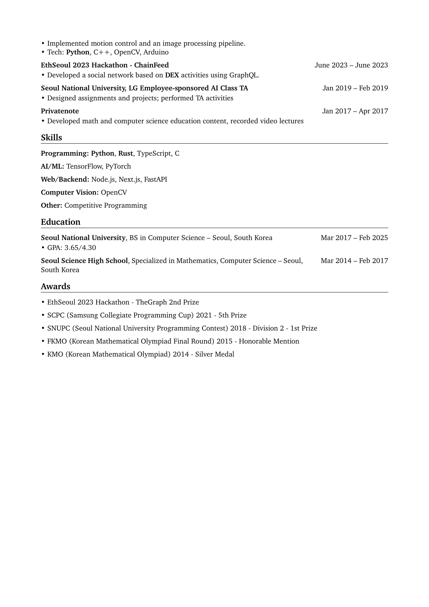

# Yooseok Jeong — CV

[](rendercv_output/Yooseok_Jeong_CV.pdf)
[](rendercv_output/Yooseok_Jeong_CV.pdf)

The latest PDF is available here: [Link](rendercv_output/Yooseok_Jeong_CV.pdf)

## About this repo

- Source CV data: `Yooseok_Jeong_CV.yaml`
- Output generated by RenderCV into `rendercv_output/`

## Regenerating the CV

If you have RenderCV installed, you can rebuild the PDF from the YAML source:

```bash
rendercv render Yooseok_Jeong_CV.yaml
```

This will update the files under `rendercv_output/`.
